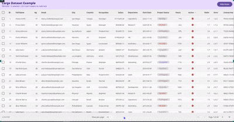
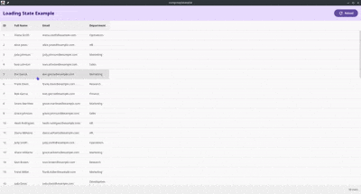
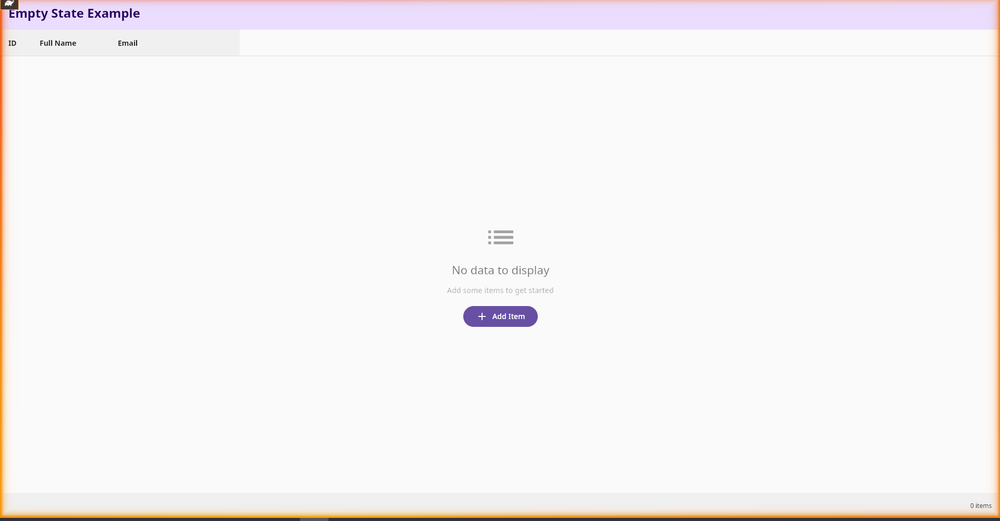

# Compose DataTable

A highly customizable, feature-rich `DataTable` component for Compose Desktop built entirely on Foundation APIs -- no Material dependency required.

[](https://central.sonatype.com/artifact/io.github.stephenwanjala/datatable)
[](https://www.apache.org/licenses/LICENSE-2.0)

## Demo

### Large Dataset with Sorting, Selection & Pagination




### Loading State



### Empty State



## Features

- **Column sorting** -- single-click header to sort, Ctrl+click for multi-column sort
- **Row selection** -- none, single, or multi-select with checkboxes
- **Row expansion** -- expand rows to show custom detail content
- **Frozen/pinned columns** -- pin columns to the left edge so they don't scroll horizontally
- **Column resizing** -- drag column edges to resize
- **Pagination** -- configurable page size with items-per-page selector
- **Grouping** -- group rows by a key with custom group header and summary rows
- **Keyboard navigation** -- Arrow keys, Enter, Space, Home, End
- **Row hover & alternating colors** -- visual row highlighting
- **Right-click context menu** -- callback with item and position
- **Column visibility toggle** -- show/hide columns dynamically
- **Text overflow** -- per-column `maxLines` and `TextOverflow` control
- **Custom sort comparators** -- override default comparable-based sorting
- **Custom cell content** -- full composable control over any cell or header
- **Programmatic scroll** -- scroll to a specific row via `DataTableState`
- **Fully themeable** -- customize all colors and text styles without any theming framework
- **Zero Material dependency** -- built on Compose Foundation only

## Installation

Add the dependency to your `build.gradle.kts`:

```kotlin
dependencies {
    implementation("io.github.stephenwanjala:datatable:0.1.1")
}
```

## Quick Start

```kotlin
data class Person(val id: Int, val name: String, val age: Int, val email: String)

val people = listOf(
    Person(1, "Alice Smith", 30, "alice@example.com"),
    Person(2, "Bob Johnson", 25, "bob@example.com"),
    Person(3, "Charlie Brown", 35, "charlie@example.com"),
)

val headers = listOf(
    DataTableHeader<Person>(key = "id", title = "ID", value = { it.id }, width = 60.dp),
    DataTableHeader(key = "name", title = "Name", value = { it.name }, width = 150.dp),
    DataTableHeader(key = "age", title = "Age", value = { it.age }, width = 80.dp),
    DataTableHeader(key = "email", title = "Email", value = { it.email }, width = 250.dp),
)

DataTable(
    items = people,
    headers = headers,
    itemKey = { it.id },
)
```

## Usage Guide

### Column Definition

Columns are defined using `DataTableHeader<T>`:

```kotlin
DataTableHeader<Person>(
    key = "salary",                          // unique column identifier
    title = "Salary",                        // header label
    value = { "$${it.salary}" },             // value extractor for display
    width = 120.dp,                          // fixed width (null = fill with weight)
    align = TextAlign.End,                   // text alignment
    sortable = true,                         // enable sorting
    fixed = false,                           // true = frozen/pinned column
    visible = true,                          // toggle visibility
    maxLines = 1,                            // text line limit
    overflow = TextOverflow.Ellipsis,        // overflow strategy
    comparator = compareBy { it.salary },    // custom sort comparator
    cellContent = { item ->                  // custom cell composable
        Text("$${String.format("%.2f", item.salary)}")
    },
    headerContent = {                        // custom header composable
        Text("Salary (USD)", fontWeight = FontWeight.Bold)
    },
)
```

### Selection

```kotlin
var selectedItems by remember { mutableStateOf<Set<Person>>(emptySet()) }

DataTable(
    items = people,
    headers = headers,
    itemKey = { it.id },
    showSelect = true,                          // show checkboxes
    selectionMode = SelectionMode.MULTI,        // NONE, SINGLE, or MULTI
    selectedItems = selectedItems,
    onSelectionChange = { selectedItems = it },
)
```

| Mode | Behavior |
|------|----------|
| `SelectionMode.NONE` | No selection UI. Row clicks still fire `onRowClick`. |
| `SelectionMode.SINGLE` | One row at a time. Clicking a selected row deselects it. |
| `SelectionMode.MULTI` | Multiple rows with a select-all checkbox in the header. |

### Sorting

**Single-column sort:**

```kotlin
var sortState by remember { mutableStateOf(SortState()) }

DataTable(
    // ...
    sortBy = sortState,
    onSortChange = { sortState = it },
)
```

**Multi-column sort (Ctrl+click):**

```kotlin
var multiSort by remember { mutableStateOf<List<SortState>>(emptyList()) }

DataTable(
    // ...
    multiSortBy = multiSort,
    onMultiSortChange = { multiSort = it },
)
```

### Pagination

```kotlin
var currentPage by remember { mutableStateOf(0) }
var itemsPerPage by remember { mutableStateOf(25) }

DataTable(
    // ...
    showPagination = true,
    itemsPerPage = itemsPerPage,
    currentPage = currentPage,
    onPageChange = { currentPage = it },
    itemsPerPageOptions = listOf(10, 25, 50, 100),
    onItemsPerPageChange = {
        itemsPerPage = it
        currentPage = 0
    },
)
```

### Frozen (Pinned) Columns

Mark columns as `fixed = true` with an explicit `width`:

```kotlin
DataTableHeader<Person>(
    key = "id",
    title = "ID",
    value = { it.id },
    width = 60.dp,
    fixed = true,    // pinned to the left, won't scroll horizontally
)
```

### Row Expansion

```kotlin
var expandedItems by remember { mutableStateOf<Set<Person>>(emptySet()) }

DataTable(
    // ...
    showExpand = true,
    expandedItems = expandedItems,
    onExpandChange = { expandedItems = it },
    expandContent = { person ->
        Column(Modifier.padding(16.dp)) {
            Text("Details for ${person.name}")
            Text("Email: ${person.email}")
        }
    },
)
```

### Resizable Columns

```kotlin
DataTable(
    // ...
    resizableColumns = true,
    minColumnWidth = 50.dp,
)
```

Drag the right edge of any column header to resize. Call `state.resetColumnWidths()` to revert.

### Grouping

```kotlin
DataTable(
    // ...
    groupBy = { it.department },
    groupHeaderContent = { groupName, items ->
        Text("$groupName (${items.size})", fontWeight = FontWeight.Bold)
    },
    groupSummaryContent = { groupName, items ->
        Text("Average age: ${items.map { it.age }.average().toInt()}")
    },
)
```

### Row Interactions

```kotlin
DataTable(
    // ...
    onRowClick = { person -> println("Clicked: ${person.name}") },
    onRowDoubleClick = { person -> println("Double-clicked: ${person.name}") },
    onRowContextMenu = { person, offset -> println("Right-click: ${person.name} at $offset") },
)
```

### Keyboard Navigation

Focus the table and use:

| Key | Action |
|-----|--------|
| Arrow Up / Down | Move focused row |
| Enter | Trigger `onRowClick` on focused row |
| Space | Toggle selection on focused row |
| Home | Focus first row |
| End | Focus last row |

### Loading & Empty States

```kotlin
DataTable(
    // ...
    loading = isLoading,
    loadingContent = {                         // optional custom loading UI
        CircularProgressIndicator()
    },
    noDataContent = {                          // optional custom empty state
        Text("No results found")
    },
)
```

### Custom Headers & Footers

```kotlin
DataTable(
    // ...
    hideDefaultHeader = true,
    headerContent = { /* your custom header composable */ },
    hideDefaultFooter = true,
    footerContent = { /* your custom footer composable */ },
)
```

### Theming

Fully customize colors and text styles without Material or any theming framework:

```kotlin
DataTable(
    // ...
    colors = DataTableDefaults.colors(
        container = Color.White,
        header = Color(0xFFF5F5F5),
        selectedRow = Color(0x4D1976D2),
        hoveredRow = Color(0x1A000000),
        rowAlternate = Color(0xFFFAFAFA),
        divider = Color(0xFFE0E0E0),
        checkboxChecked = Color(0xFF1976D2),
        focusedRowBorder = Color(0xFF1976D2),
    ),
    textStyles = DataTableDefaults.textStyles(
        headerCell = TextStyle(fontSize = 14.sp, fontWeight = FontWeight.Bold),
        bodyCell = TextStyle(fontSize = 14.sp),
        footer = TextStyle(fontSize = 12.sp),
    ),
    density = DataTableDensity.COMPACT,    // DEFAULT, COMFORTABLE, or COMPACT
)
```

### DataTableState

Use `DataTableState` for programmatic control:

```kotlin
val tableState = rememberDataTableState()

// Scroll to a specific row
LaunchedEffect(Unit) {
    tableState.animateScrollToItem(index = 42)
}

// Reset user-resized columns
Button(onClick = { tableState.resetColumnWidths() }) {
    Text("Reset Columns")
}

DataTable(
    // ...
    state = tableState,
)
```

## API Reference

### DataTable Parameters

| Parameter | Type | Default | Description |
|-----------|------|---------|-------------|
| `items` | `List<T>` | required | Data items to display |
| `headers` | `List<DataTableHeader<T>>` | required | Column definitions |
| `modifier` | `Modifier` | `Modifier` | Compose modifier |
| `state` | `DataTableState` | `rememberDataTableState()` | Table state for programmatic control |
| `itemKey` | `(T) -> Any` | `hashCode()` | Stable key for each item |
| `showSelect` | `Boolean` | `false` | Show selection checkboxes |
| `selectionMode` | `SelectionMode` | `MULTI` if `showSelect`, else `NONE` | Selection behavior |
| `selectedItems` | `Set<T>` | `emptySet()` | Currently selected items |
| `onSelectionChange` | `((Set<T>) -> Unit)?` | `null` | Selection change callback |
| `showExpand` | `Boolean` | `false` | Show expand/collapse buttons |
| `expandedItems` | `Set<T>` | `emptySet()` | Currently expanded items |
| `onExpandChange` | `((Set<T>) -> Unit)?` | `null` | Expansion change callback |
| `expandContent` | `(@Composable (T) -> Unit)?` | `null` | Custom expanded row content |
| `density` | `DataTableDensity` | `DEFAULT` | Row padding density |
| `colors` | `DataTableColors` | `DataTableDefaults.colors()` | Color customization |
| `textStyles` | `DataTableTextStyles` | `DataTableDefaults.textStyles()` | Text style customization |
| `sortBy` | `SortState` | `SortState()` | Current single-column sort |
| `onSortChange` | `((SortState) -> Unit)?` | `null` | Sort change callback |
| `multiSortBy` | `List<SortState>` | `emptyList()` | Multi-column sort states |
| `onMultiSortChange` | `((List<SortState>) -> Unit)?` | `null` | Multi-sort change callback |
| `resizableColumns` | `Boolean` | `false` | Enable column drag-to-resize |
| `minColumnWidth` | `Dp` | `40.dp` | Minimum column width when resizing |
| `hideDefaultHeader` | `Boolean` | `false` | Hide the built-in header row |
| `hideDefaultFooter` | `Boolean` | `false` | Hide the built-in footer |
| `loading` | `Boolean` | `false` | Show loading state |
| `loadingContent` | `(@Composable () -> Unit)?` | `null` | Custom loading composable |
| `headerContent` | `(@Composable () -> Unit)?` | `null` | Custom header composable |
| `footerContent` | `(@Composable () -> Unit)?` | `null` | Custom footer composable |
| `noDataContent` | `(@Composable () -> Unit)?` | `null` | Custom empty state composable |
| `groupBy` | `((T) -> String)?` | `null` | Row grouping function |
| `groupHeaderContent` | `(@Composable (String, List<T>) -> Unit)?` | `null` | Custom group header |
| `groupSummaryContent` | `(@Composable (String, List<T>) -> Unit)?` | `null` | Custom group summary |
| `onRowClick` | `((T) -> Unit)?` | `null` | Row click callback |
| `onRowDoubleClick` | `((T) -> Unit)?` | `null` | Row double-click callback |
| `onRowContextMenu` | `((T, Offset) -> Unit)?` | `null` | Right-click callback |
| `showPagination` | `Boolean` | `false` | Enable pagination footer |
| `itemsPerPage` | `Int` | `10` | Items per page |
| `currentPage` | `Int` | `0` | Current page index (zero-based) |
| `onPageChange` | `((Int) -> Unit)?` | `null` | Page change callback |
| `itemsPerPageOptions` | `List<Int>` | `[10, 25, 50, 100]` | Page size options |
| `onItemsPerPageChange` | `((Int) -> Unit)?` | `null` | Page size change callback |
| `showScrollbars` | `Boolean` | `true` | Show scrollbars |

## Requirements

- Kotlin 2.x+
- Compose Multiplatform 1.9+
- JVM 21+

## License

```
Copyright 2025 Wanjala Stephen

Licensed under the Apache License, Version 2.0 (the "License");
you may not use this file except in compliance with the License.
You may obtain a copy of the License at

    https://www.apache.org/licenses/LICENSE-2.0

Unless required by applicable law or agreed to in writing, software
distributed under the License is distributed on an "AS IS" BASIS,
WITHOUT WARRANTIES OR CONDITIONS OF ANY KIND, either express or implied.
See the License for the specific language governing permissions and
limitations under the License.
```
