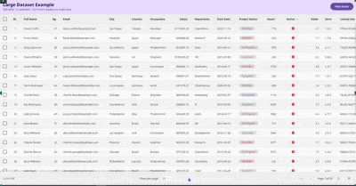
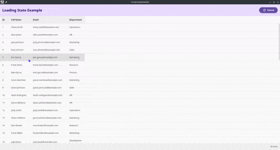
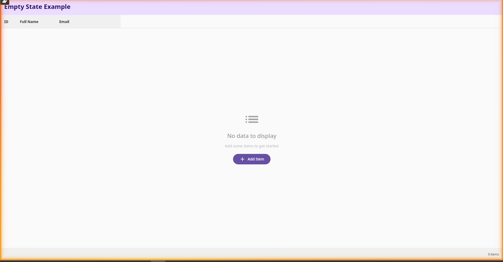

# Compose DataTable

A highly customizable, feature-rich `DataTable` component for Compose Desktop built entirely on Foundation APIs -- no Material dependency required.

[](https://central.sonatype.com/artifact/io.github.stephenwanjala/datatable)
[](https://www.apache.org/licenses/LICENSE-2.0)

## Demo

### Large Dataset with Sorting, Selection & Pagination




### Loading State



### Empty State



## Features

- **Column sorting** -- single-click header to sort, Ctrl+click for multi-column sort
- **Row selection** -- none, single, or multi-select with checkboxes
- **Row expansion** -- expand rows to show custom detail content
- **Nested headers** -- group columns under a spanning header band, to any depth
- **Frozen/pinned columns** -- pin columns to the left edge so they don't scroll horizontally
- **Column resizing** -- drag column edges to resize
- **Pagination** -- configurable page size with items-per-page selector
- **Server-side data** -- `manualSorting` / `manualPagination` hand sorting and paging to your database
- **Grouping** -- group rows by a key with custom group header and summary rows
- **Keyboard navigation** -- Arrow keys, Enter, Space, Home, End
- **Row hover & alternating colors** -- visual row highlighting
- **Right-click context menu** -- callback with item and position
- **Column visibility toggle** -- show/hide columns dynamically
- **Text overflow** -- per-column `maxLines` and `TextOverflow` control
- **Custom sort comparators** -- override default comparable-based sorting
- **Custom cell content** -- full composable control over any cell or header
- **Programmatic scroll** -- scroll to a specific row via `DataTableState`
- **Fully themeable** -- customize all colors and text styles without any theming framework
- **Zero Material dependency** -- built on Compose Foundation only

## Installation

Add the dependency to your `build.gradle.kts`:

```kotlin
dependencies {
    implementation("io.github.stephenwanjala:datatable:0.2.0")
}
```

Upgrading from 0.1.x? See [Migrating to 0.2.0](#migrating-to-020).

## Quick Start

```kotlin
data class Person(val id: Int, val name: String, val age: Int, val email: String)

val people = listOf(
    Person(1, "Alice Smith", 30, "alice@example.com"),
    Person(2, "Bob Johnson", 25, "bob@example.com"),
    Person(3, "Charlie Brown", 35, "charlie@example.com"),
)

val headers = listOf(
    DataTableHeader<Person>(key = "id", title = "ID", value = { it.id }, width = 60.dp),
    DataTableHeader(key = "name", title = "Name", value = { it.name }, width = 150.dp),
    DataTableHeader(key = "age", title = "Age", value = { it.age }, width = 80.dp),
    DataTableHeader(key = "email", title = "Email", value = { it.email }, width = 250.dp),
)

DataTable(
    items = people,
    headers = headers,
    itemKey = { it.id },
)
```

`itemKey` is required and must be **unique across `items`** — use a database id or equivalent.
It backs row identity during scrolling as well as selection and expansion, so two rows sharing
a key will select, expand, and recycle as a single row.

## Usage Guide

### Column Definition

Columns are defined using `DataTableHeader<T>`:

```kotlin
DataTableHeader<Person>(
    key = "salary",                          // unique column identifier
    title = "Salary",                        // header label
    value = { "$${it.salary}" },             // value extractor for display
    width = 120.dp,                          // fixed width (null = fill with weight)
    align = TextAlign.End,                   // text alignment
    sortable = true,                         // enable sorting
    fixed = false,                           // true = frozen/pinned column
    visible = true,                          // toggle visibility
    maxLines = 1,                            // text line limit
    overflow = TextOverflow.Ellipsis,        // overflow strategy
    comparator = compareBy { it.salary },    // custom sort comparator
    cellContent = { item ->                  // custom cell composable
        Text("$${String.format("%.2f", item.salary)}")
    },
    headerContent = {                        // custom header composable
        Text("Salary (USD)", fontWeight = FontWeight.Bold)
    },
)
```

### Nested (Grouped) Headers

Give a header `children` and it becomes a group: a band drawn above its children, spanning them.
Only the leaves render as real columns — sorting, resizing, and cell content all belong to them.

```kotlin
val headers = listOf(
    DataTableHeader<Person>(key = "id", title = "ID", value = { it.id }, width = 60.dp),
    DataTableHeader(
        key = "contact",
        title = "Contact",
        children = listOf(
            DataTableHeader(key = "email", title = "Email", value = { it.email }, width = 200.dp),
            DataTableHeader(key = "phone", title = "Phone", value = { it.phone }, width = 140.dp),
        ),
    ),
)
```

```
┌──────┬───────────────────────────────┐
│      │            Contact            │
│  ID  ├───────────────┬───────────────┤
│      │     Email     │     Phone     │
├──────┼───────────────┼───────────────┤
```

Groups nest to any depth. A leaf sitting beside a group — `ID` above — stretches over the full
header height and centres its title, rather than leaving blank rows above it.

Two rules, both enforced with a thrown error rather than a silent misrender:

- Every leaf under one group must be **either all fixed-width or all weighted**. A group takes
  its width from its leaves, and the two sizing models cannot be summed.
- A group cannot **straddle the freeze boundary** — mark every column under it `fixed = true`, or
  none of them. Half a group would scroll out from under the other half.

### Selection

Selection is tracked by **row key** — the value returned by `itemKey` — not by the item itself.
This means selection survives item instances being replaced (say, a refresh from your repository)
and your row type does not need to implement `equals`/`hashCode`.

```kotlin
var selectedKeys by remember { mutableStateOf<Set<Any>>(emptySet()) }

DataTable(
    items = people,
    headers = headers,
    itemKey = { it.id },                        // this is the selection identity
    showSelect = true,                          // show checkboxes
    selectionMode = SelectionMode.MULTI,        // NONE, SINGLE, or MULTI
    selectedKeys = selectedKeys,
    onSelectionChange = { selectedKeys = it },
)
```

To resolve keys back to items:

```kotlin
val selectedPeople = people.filter { it.id in selectedKeys }
```

| Mode | Behavior |
|------|----------|
| `SelectionMode.NONE` | No selection UI. Row clicks still fire `onRowClick`. |
| `SelectionMode.SINGLE` | One row at a time. Clicking a selected row deselects it. |
| `SelectionMode.MULTI` | Multiple rows with a select-all checkbox in the header. |

### Sorting

**Single-column sort:**

```kotlin
var sortState by remember { mutableStateOf(SortState()) }

DataTable(
    // ...
    sortBy = sortState,
    onSortChange = { sortState = it },
)
```

**Multi-column sort (Ctrl+click):**

```kotlin
var multiSort by remember { mutableStateOf<List<SortState>>(emptyList()) }

DataTable(
    // ...
    multiSortBy = multiSort,
    onMultiSortChange = { multiSort = it },
)
```

**Controlled vs uncontrolled.** Supplying `onSortChange` makes sorting *controlled*: the table
renders whatever `sortBy` says and never changes it on its own, so you must feed the new value
back — exactly like `TextField(value, onValueChange)`. Omit the callback and the table owns the
sort state internally, which is why click-to-sort works in the Quick Start with no wiring at all.

`onMultiSortChange` and `onPageChange` behave the same way for multi-sort and for the current page.

### Pagination

```kotlin
var currentPage by remember { mutableStateOf(0) }
var itemsPerPage by remember { mutableStateOf(25) }

DataTable(
    // ...
    showPagination = true,
    itemsPerPage = itemsPerPage,
    currentPage = currentPage,
    onPageChange = { currentPage = it },
    itemsPerPageOptions = listOf(10, 25, 50, 100),
    onItemsPerPageChange = {
        itemsPerPage = it
        currentPage = 0
    },
)
```

### Server-Side Data

By default the table sorts and pages `items` itself, which means every row has to be in memory.
For an ERP-scale table backed by a database, hand it one page at a time and let SQL do the work:

```kotlin
var page by remember { mutableStateOf(0) }
var pageSize by remember { mutableStateOf(25) }
var sort by remember { mutableStateOf(SortState("name", SortOrder.ASCENDING)) }

// Re-query whenever the page or the sort changes
val result by produceState<PageResult?>(null, page, pageSize, sort) {
    value = repository.findPeople(offset = page * pageSize, limit = pageSize, sort = sort)
}

DataTable(
    items = result?.rows.orEmpty(),   // just this page
    headers = headers,
    itemKey = { it.id },
    loading = result == null,

    manualSorting = true,             // rows arrive already ordered
    sortBy = sort,
    onSortChange = { sort = it },

    showPagination = true,
    manualPagination = true,          // items IS the current page
    totalItems = result?.total ?: 0,  // required: only you know the real total
    itemsPerPage = pageSize,
    currentPage = page,
    onPageChange = { page = it },
    onItemsPerPageChange = { pageSize = it },
)
```

| Parameter | Effect |
|-----------|--------|
| `manualSorting = true` | The table never reorders `items`. Headers still show sort indicators and report clicks, so you translate them into `ORDER BY`. |
| `manualPagination = true` | The table never slices `items` — it renders them as the current page. Requires `totalItems`. |
| `totalItems` | Row count across every page, used for the page count and the footer's range. Defaults to `items.size`, which is only correct when the table holds all the rows. |

`manualPagination = true` without `totalItems` throws, rather than quietly reporting one page.

Note that with `manualPagination` the select-all checkbox covers the **loaded page**, not the
whole result set — the table cannot select rows it has never seen. Handle "select all N matching
rows" yourself if you need it.

### Frozen (Pinned) Columns

Mark columns as `fixed = true` with an explicit `width`:

```kotlin
DataTableHeader<Person>(
    key = "id",
    title = "ID",
    value = { it.id },
    width = 60.dp,
    fixed = true,    // pinned to the left, won't scroll horizontally
)
```

### Row Expansion

Like selection, expansion is tracked by **row key** — the value returned by `itemKey`.

```kotlin
var expandedKeys by remember { mutableStateOf<Set<Any>>(emptySet()) }

DataTable(
    // ...
    itemKey = { it.id },
    showExpand = true,
    expandedKeys = expandedKeys,
    onExpandChange = { expandedKeys = it },
    expandContent = { person ->
        Column(Modifier.padding(16.dp)) {
            Text("Details for ${person.name}")
            Text("Email: ${person.email}")
        }
    },
)
```

### Resizable Columns

```kotlin
DataTable(
    // ...
    resizableColumns = true,
    minColumnWidth = 50.dp,
)
```

Drag the right edge of any column header to resize. Call `state.resetColumnWidths()` to revert.

### Grouping

```kotlin
DataTable(
    // ...
    groupBy = { it.department },
    groupHeaderContent = { groupName, items ->
        Text("$groupName (${items.size})", fontWeight = FontWeight.Bold)
    },
    groupSummaryContent = { groupName, items ->
        Text("Average age: ${items.map { it.age }.average().toInt()}")
    },
)
```

### Row Interactions

```kotlin
DataTable(
    // ...
    onRowClick = { person -> println("Clicked: ${person.name}") },
    onRowDoubleClick = { person -> println("Double-clicked: ${person.name}") },
    onRowContextMenu = { person, offset -> println("Right-click: ${person.name} at $offset") },
)
```

### Keyboard Navigation

Focus the table and use:

| Key | Action |
|-----|--------|
| Arrow Up / Down | Move focused row |
| Enter | Trigger `onRowClick` on focused row |
| Space | Toggle selection on focused row |
| Home | Focus first row |
| End | Focus last row |

The focused row is tracked by key, exposed as `state.focusedKey: Any?`. Because it is a key
rather than a position, focus stays on the same row when the table is re-sorted instead of
staying at a fixed offset. If the focused row leaves the view entirely — filtered out, or on
another page — the next arrow key starts again from the first row.

### Loading & Empty States

```kotlin
DataTable(
    // ...
    loading = isLoading,
    loadingContent = {                         // optional custom loading UI
        CircularProgressIndicator()
    },
    noDataContent = {                          // optional custom empty state
        Text("No results found")
    },
)
```

### Custom Headers & Footers

```kotlin
DataTable(
    // ...
    hideDefaultHeader = true,
    headerContent = { /* your custom header composable */ },
    hideDefaultFooter = true,
    footerContent = { /* your custom footer composable */ },
)
```

### Theming

Fully customize colors and text styles without Material or any theming framework:

```kotlin
DataTable(
    // ...
    colors = DataTableDefaults.colors(
        container = Color.White,
        header = Color(0xFFF5F5F5),
        selectedRow = Color(0x4D1976D2),
        hoveredRow = Color(0x1A000000),
        rowAlternate = Color(0xFFFAFAFA),
        divider = Color(0xFFE0E0E0),
        checkboxChecked = Color(0xFF1976D2),
        focusedRowBorder = Color(0xFF1976D2),
    ),
    textStyles = DataTableDefaults.textStyles(
        headerCell = TextStyle(fontSize = 14.sp, fontWeight = FontWeight.Bold),
        bodyCell = TextStyle(fontSize = 14.sp),
        footer = TextStyle(fontSize = 12.sp),
    ),
    density = DataTableDensity.COMPACT,    // DEFAULT, COMFORTABLE, or COMPACT
)
```

### DataTableState

Use `DataTableState` for programmatic control:

```kotlin
val tableState = rememberDataTableState()

// Scroll to a specific row
LaunchedEffect(Unit) {
    tableState.animateScrollToItem(index = 42)
}

// Reset user-resized columns
Button(onClick = { tableState.resetColumnWidths() }) {
    Text("Reset Columns")
}

// Key of the keyboard-focused row, or null
val focused = tableState.focusedKey

// Move keyboard focus to a row, and scroll it into view
val position = people.indexOfFirst { it.id == personId }
tableState.focusRow(personId)
if (position >= 0) {
    scope.launch { tableState.animateScrollToItem(position) }
}

// Clear focus
tableState.focusRow(null)

DataTable(
    // ...
    state = tableState,
)
```

## API Reference

### DataTable Parameters

| Parameter | Type | Default | Description |
|-----------|------|---------|-------------|
| `items` | `List<T>` | required | Data items to display |
| `headers` | `List<DataTableHeader<T>>` | required | Column definitions |
| `itemKey` | `(T) -> Any` | required | Stable, unique key per row — also the selection/expansion identity |
| `modifier` | `Modifier` | `Modifier` | Compose modifier |
| `state` | `DataTableState` | `rememberDataTableState()` | Table state for programmatic control |
| `showSelect` | `Boolean` | `false` | Show selection checkboxes |
| `selectionMode` | `SelectionMode` | `MULTI` if `showSelect`, else `NONE` | Selection behavior |
| `selectedKeys` | `Set<Any>` | `emptySet()` | Keys (from `itemKey`) of the selected rows |
| `onSelectionChange` | `((Set<Any>) -> Unit)?` | `null` | Selection change callback |
| `showExpand` | `Boolean` | `false` | Show expand/collapse buttons |
| `expandedKeys` | `Set<Any>` | `emptySet()` | Keys (from `itemKey`) of the expanded rows |
| `onExpandChange` | `((Set<Any>) -> Unit)?` | `null` | Expansion change callback |
| `expandContent` | `(@Composable (T) -> Unit)?` | `null` | Custom expanded row content |
| `density` | `DataTableDensity` | `DEFAULT` | Row padding density |
| `colors` | `DataTableColors` | `DataTableDefaults.colors()` | Color customization |
| `textStyles` | `DataTableTextStyles` | `DataTableDefaults.textStyles()` | Text style customization |
| `sortBy` | `SortState` | `SortState()` | Current single-column sort |
| `onSortChange` | `((SortState) -> Unit)?` | `null` | Sort change callback |
| `multiSortBy` | `List<SortState>` | `emptyList()` | Multi-column sort states |
| `onMultiSortChange` | `((List<SortState>) -> Unit)?` | `null` | Multi-sort change callback; supplying it makes multi-sort controlled |
| `manualSorting` | `Boolean` | `false` | Table does not reorder `items`; caller sorts (e.g. in SQL) |
| `resizableColumns` | `Boolean` | `false` | Enable column drag-to-resize |
| `minColumnWidth` | `Dp` | `40.dp` | Minimum column width when resizing |
| `hideDefaultHeader` | `Boolean` | `false` | Hide the built-in header row |
| `hideDefaultFooter` | `Boolean` | `false` | Hide the built-in footer |
| `loading` | `Boolean` | `false` | Show loading state |
| `loadingContent` | `(@Composable () -> Unit)?` | `null` | Custom loading composable |
| `headerContent` | `(@Composable () -> Unit)?` | `null` | Custom header composable |
| `footerContent` | `(@Composable () -> Unit)?` | `null` | Custom footer composable |
| `noDataContent` | `(@Composable () -> Unit)?` | `null` | Custom empty state composable |
| `groupBy` | `((T) -> String)?` | `null` | Row grouping function |
| `groupHeaderContent` | `(@Composable (String, List<T>) -> Unit)?` | `null` | Custom group header |
| `groupSummaryContent` | `(@Composable (String, List<T>) -> Unit)?` | `null` | Custom group summary |
| `onRowClick` | `((T) -> Unit)?` | `null` | Row click callback |
| `onRowDoubleClick` | `((T) -> Unit)?` | `null` | Row double-click callback |
| `onRowContextMenu` | `((T, Offset) -> Unit)?` | `null` | Right-click callback |
| `showPagination` | `Boolean` | `false` | Enable pagination footer |
| `itemsPerPage` | `Int` | `10` | Items per page |
| `currentPage` | `Int` | `0` | Current page index (zero-based) |
| `onPageChange` | `((Int) -> Unit)?` | `null` | Page change callback |
| `itemsPerPageOptions` | `List<Int>` | `[10, 25, 50, 100]` | Page size options |
| `onItemsPerPageChange` | `((Int) -> Unit)?` | `null` | Page size change callback |
| `manualPagination` | `Boolean` | `false` | `items` is already the current page; requires `totalItems` |
| `totalItems` | `Int?` | `null` (= `items.size`) | Row count across all pages |
| `showScrollbars` | `Boolean` | `true` | Show scrollbars |

## Migrating to 0.2.0

Selection, expansion, and keyboard focus are now tracked by **row key** instead of by item.
Every change below is a compile error on upgrade, not a silent behavior change, so the compiler
will point at each call site.

| 0.1.x | 0.2.0 |
|-------|-------|
| `selectedItems: Set<T>` | `selectedKeys: Set<Any>` |
| `expandedItems: Set<T>` | `expandedKeys: Set<Any>` |
| `itemKey` optional, defaulted to `hashCode()` | required, and moved ahead of `modifier` |
| `state.focusedRowIndex: Int` (`-1` when unfocused) | `state.focusedKey: Any?` (`null` when unfocused) |

### Selection and expansion

Hoist keys rather than items:

```kotlin
// 0.1.x
var selectedItems by remember { mutableStateOf<Set<Person>>(emptySet()) }
var expandedItems by remember { mutableStateOf<Set<Person>>(emptySet()) }

DataTable(
    items = people,
    headers = headers,
    selectedItems = selectedItems,
    onSelectionChange = { selectedItems = it },
    expandedItems = expandedItems,
    onExpandChange = { expandedItems = it },
)

// 0.2.0
var selectedKeys by remember { mutableStateOf<Set<Any>>(emptySet()) }
var expandedKeys by remember { mutableStateOf<Set<Any>>(emptySet()) }

DataTable(
    items = people,
    headers = headers,
    itemKey = { it.id },
    selectedKeys = selectedKeys,
    onSelectionChange = { selectedKeys = it },
    expandedKeys = expandedKeys,
    onExpandChange = { expandedKeys = it },
)
```

Where you previously read selected items directly, resolve them from keys:

```kotlin
val selectedPeople = people.filter { it.id in selectedKeys }
```

This is what the change buys you: selection and expansion now survive item instances being
replaced — a refresh from your repository, for example — and your row type no longer needs to
implement `equals`/`hashCode`.

### itemKey

`itemKey` is required and must be **unique across `items`**. Two rows sharing a key will select,
expand, and recycle as a single row. Use a database id or equivalent:

```kotlin
itemKey = { it.id },
```

The old `{ it.hashCode() }` default collides for equal-valued rows. It was already unsound for
`LazyColumn` identity, and now that it also backs selection, expansion, and focus, it is gone
rather than left as a trap.

It also moved ahead of `modifier` in the parameter list, keeping the Compose convention of
required parameters first. Call sites that pass it by name — as all the examples here do — are
unaffected by the reordering.

### Keyboard focus

```kotlin
// 0.1.x
val focused = state.focusedRowIndex          // -1 when nothing is focused

// 0.2.0
val focused = state.focusedKey               // null when nothing is focused
state.focusRow(person.id)                    // move focus programmatically
state.focusRow(null)                         // clear focus
```

Focus now stays on its row when the table is re-sorted, instead of holding a fixed position.
If the focused row leaves the view — filtered out, or on another page — the next arrow key
starts again from the first row.

### Fixes that may change what you see

No API change needed for these, but the rendering differs:

- **Alternating row colors** were offset by the total item count, flipping which rows were
  tinted on odd-sized lists. They now start correctly at the first row.
- **The keyboard focus indicator** never appeared in any configuration. It now renders on the
  focused row, so a `focusedRowBorder` color you set in 0.1.x becomes visible for the first time.
- **Enter and Space** acted on the wrong row when `groupBy` was set, because navigation walked
  the pre-grouping order. They now follow display order.
- **Arrow-key scrolling** overshot when group headers or summaries were present.

## Requirements

- Kotlin 2.x+
- Compose Multiplatform 1.9+
- JVM 21+

## License

```
Copyright 2025 Wanjala Stephen

Licensed under the Apache License, Version 2.0 (the "License");
you may not use this file except in compliance with the License.
You may obtain a copy of the License at

    https://www.apache.org/licenses/LICENSE-2.0

Unless required by applicable law or agreed to in writing, software
distributed under the License is distributed on an "AS IS" BASIS,
WITHOUT WARRANTIES OR CONDITIONS OF ANY KIND, either express or implied.
See the License for the specific language governing permissions and
limitations under the License.
```
